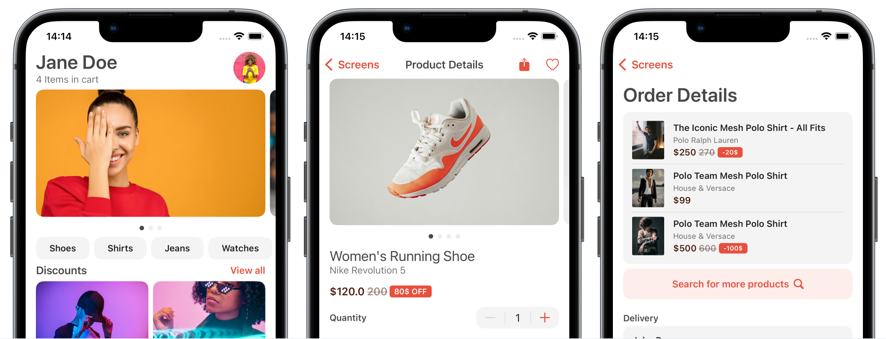
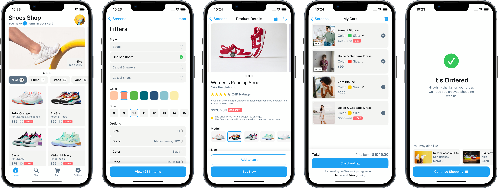
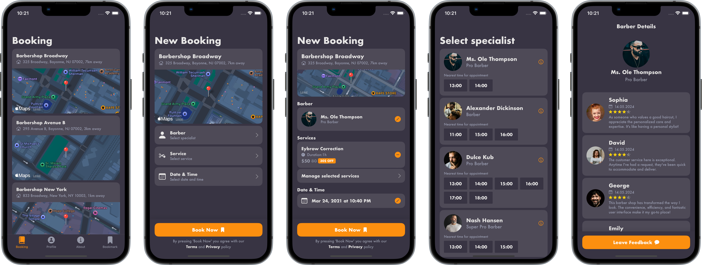

<p align="center">
    
</p>
<p align="center">
    
    
    <a href="https://swift.org/package-manager">
        
    </a>
</p>


# What is DSKit?

DSKit is a simple Design System Kit for **iOS 15+ SwiftUI**, designed to help developers create simple, consistent, and attractive user interfaces with ease. To help you get started, DSKit includes demonstration screen code showcasing a wide range of possibilities. With over 60 ready-to-use screens, you can see the full potential of DSKit in action. This extensive collection of ready-made code can be directly utilized in your next project, making it easier to integrate DSKit's features and functionalities seamlessly.




## Get Started

> [!Note]
> If you're looking for the UIKit version of DSKit, you can find it here: [UIKit Version](https://github.com/imodeveloperlab/dskit).

To get started with DSKit, you can integrate it into your projects using Swift Package Manager (SPM)

### Step 1: Adding DSKit via Swift Package Manager (SPM)
To add DSKit to your project, follow these steps:

1. Open your Xcode project: Launch Xcode and open the project where you want to include DSKit.

2. Add the package dependency:
   - Go to `File` > `Swift Packages` > `Add Package Dependency...`
   - Enter the repository URL `git@github.com:imodeveloperlab/dskit-swiftui.git`.
   - Select the version of the package you wish to add. You can choose a specific release or the latest commit.
   - Xcode will download the package and ask which of your project's targets to add it to. Select the target where you want to use DSKit.

### Step 2: Set Up
Once DSKit is added to your project, you can start using it by importing the package at the top of your Swift files where you intend to use the design system components. First, set up the appearance of your app by applying `.dsAppearance(RetroAppearance())`. the RetroAppearance is one of DSKit's appearances. You can create your own [appearance](https://github.com/imodeveloperlab/dskit-swiftui/blob/main/Content/Appearance-in-DSKit.md) by copying one that you like and then modifying it as needed.

```swift
import SwiftUI
import DSKit

@main
struct DSKitDemoApp: App {
    var body: some Scene {
        WindowGroup {
            ContentView()
                .dsAppearance(RetroAppearance())
        }
    }
}
```

### Step 3: Using DSKit in Your Screens
To integrate [DSKit components](https://github.com/imodeveloperlab/dskit-swiftui/blob/main/Content/Views.md) and modifiers into your SwiftUI views, simply use them like any other SwiftUI component or modifier. Here’s an example of how you might use DSKit:

```swift
import SwiftUI
import DSKit

struct ContentView: View {
    var body: some View {
        DSVStack(alignment: .center) {
            DSText("Welcome to DSKit")
                .dsTextStyle(.title1)
                .dsPadding()
                .dsBackground(.primary)
            DSText("Design with ease")
                .dsPadding()
                .dsBackground(.secondary)
                .dsCornerRadius()
            DSButton(
                title: "Start Now!!!", 
                action: { print("Do something") }
            )
        }
        .dsScreen()
    }
}
```

In this example, [DSVStack](https://github.com/imodeveloperlab/dskit-swiftui/blob/main/Content/Views.md), [DSText](https://github.com/imodeveloperlab/dskit-swiftui/blob/main/Content/Views.md), and various modifiers like `dsPadding()` and `dsBackground()` are used. These components and modifiers are part of DSKit and help apply consistent styling and spacing as defined in your design system.

## Documentation

The most effective way to familiarize yourself with DSKit and its capabilities is by utilizing the DSKit Explorer app. To begin, clone the repository and launch the **DSKit Explorer app**. Within the app, you'll have access to all available screens, which you can open in preview mode. This feature allows you to interactively switch between different appearances and make modifications to the screens according to your preferences.

### Components and Layouts

DSKit offers a library of ready-to-use UI components and full-screen [layouts](Content/Layout-in-DSKit.md) that are designed to be easily integrated and customized within your projects. Each [component](Content/Views.md) and screen layout is fully adaptable, allowing you to tweak and refine them to perfectly fit the specific needs of your application. This accessibility accelerates the development process, enabling you to implement complex design solutions efficiently while maintaining a high standard of aesthetics and functionality.

### Appearances

DSKit includes a selection of ready-to-use [appearances](Content/Appearance-in-DSKit.md) that support both light and dark modes, suitable for immediate integration into your projects. These appearances are fully customizable, allowing you to tweak and modify them according to your specific requirements. This flexibility ensures that you can maintain consistency across different themes while adapting to user preferences. 

To dive deeper into specific features and functionalities, continue to the sections below. These segments offer detailed insights into the individual elements of DSKit, helping you leverage its full potential in your projects.

### Documents

- [Layout](Content/Layout-in-DSKit.md)
- [Views / Components](Content/Views.md)
- [Appearance](Content/Appearance-in-DSKit.md)

### Demo Screens

To help you get started, DSKit includes demonstration screen code showcasing a wide range of possibilities. With over 60 ready-to-use screens, you can see the full potential of DSKit in action. This extensive collection of ready-made code can be directly utilized in your next project, making it easier to integrate DSKit's features and functionalities seamlessly.

#### E-Commerce 



#### Barbershop



## Contributions and support

DSKit is developed completely in the open, and your contributions are more than welcome.

Before you start using DSKit in any of your projects, it’s highly recommended that you spend a few minutes familiarizing yourself with its documentation and internal implementation, so that you’ll be ready to tackle any issues or edge cases that you might encounter.

Since this is a very young project, it’s likely to have many limitations and missing features, which is something that can really only be discovered and addressed as more people start using it.

This project does not come with GitHub Issues-based support, and users are instead encouraged to become active participants in its continued development — by fixing any bugs that they encounter, or by improving the documentation wherever it’s found to be lacking.

If you wish to make a change, open a [Pull Request](https://github.com/imodeveloperlab/dskit/pulls) — even if it just contains a draft of the changes you’re planning, or a test that reproduces an issue — and we can discuss it further from there.

Hope you’ll enjoy using DSKit!
